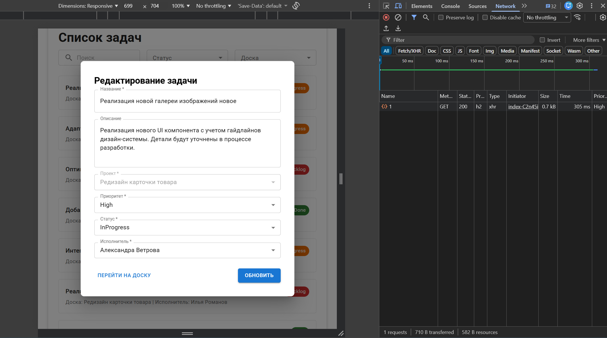
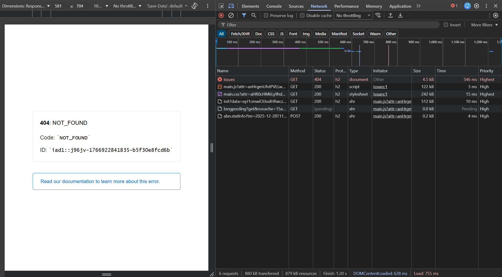
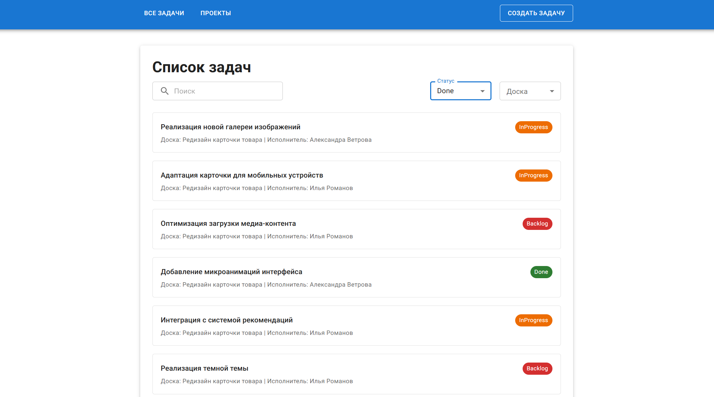

# Баг-репорты 

## №1 Кнопка "Обновить" не сохраняет изменения на основной странице 

### Приоритет: Critical

### Описание: Кнопка «Обновить» в интерфейсе редактирования задачи не сохраняет внесенные изменения в базе данных.

### Шаги воспроизведения:

1. Открыть существующую задачу.

2. Изменить название в поле «Название».

3. Изменить статус задачи.

4. Нажать кнопку «Обновить».

### Ожидаемый результат: В списке задач отображается новое название.

### Фактический результат: Изменения не отображаются, однако После обновления страницы отображается 404 ошибка.

## №2 Фильтрация задач по статусу не работает

### Приоритет: High

### Описание: При выборе определенного статуса в фильтре (например, "InProgress"), список задач не обновляется должным образом, и в нем продолжают отображаться задачи с другими статусами.

### Шаги воспроизведения:

1. Перейти на страницу со списком всех задач 

2. Нажать на выпадающий список фильтра «Статус».

3. Выбрать значение «Done».

4. Изучить появившийся список задач.

### Ожидаемый результат: В списке отображаются только те задачи, у которых установлен статус «Done».

### Фактический результат: Отображаются все существующие задачи, включая задачи со статусами «Backlog» и «InProgress»

