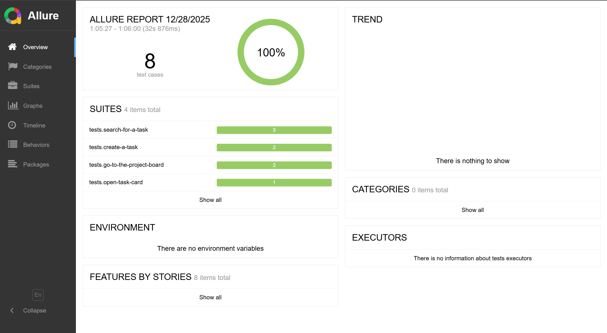

# Информация о проекте тестового задания

## Структура проекта

### К заданию №1 относится файл Задание_1.md.

### К заданию №2 относятся объекты:

- **BUGS.md** - содержит описание баг-репортов сайта таск-трекера;

- **TESTCASES.md** - содержит набор тест-кейсов к сайту таск-трекера;

- **conftest.py** - файл с фикстурами для запуска автотестов

- **allure-results** - папка с результами выполнения автотестов

- **requirements.txt** - список зависимостей проекта

- **tests** - папка с автотестами, которые содержатся в подпапках: 

1. create-a-task (Создание задачи):
   
   *test_create_task_end_list.py* - проверяет создание задачи через кнопку в конце списка.

   *test_create_task_header.py* - проверяет создание задачи через header сайта.

2. open-task-card (Открытие карточки задачи):

   *test_open_card.py* - проверяет открытие карточки задачи. 

3. search-for-a-task (Поиск задачи):

   *test_search_by_desk.py* - проверяет работу фильтра поиска задач по проекту (доске).

   *test_search_by_keyworld.py* - проверяет работу фильтра поиска задач по ключевому слову.

   *test_clear_search_data.py* - проверяет работу иконки крестика и очистки поля поиска.

4. go-to-the-project-board (Переход на доску проекта):

   *test_project_board_via_header.py* - проверяет переход на проектную доску через header.

   *test_project_board_via_task.py* - проверяет переход на проектную доску через карточку задачи.


## Специфичные локаторы

В процессе написания автотестов стандартные локаторы как `page.get_by_label` или `page.get_by_text`заменялись на специфичные методы из-за особенностей верстки веб-приложения.

Например, в связи со спецификой DOM-структуры сайта таск-трекера, например, где `label` не всегда был программно связан с `input`, использовался:

```python
page.get_by_role("combobox").nth(1)
```

В связи с отсутствием уникального текстового атрибута для навигационного элемента (список проектов) использовался локатор: 

```python
page.locator('a[href="/board/5"]')
```
Также использовался локатор для работы со списками в цикле для проверки их состояния в результате поисковой выдачи:

```python
page.locator("h6")
```

## Отчетность (Allure-report)

Для генерации и просмотра отчета отчетов использовала утилиту Allure.


