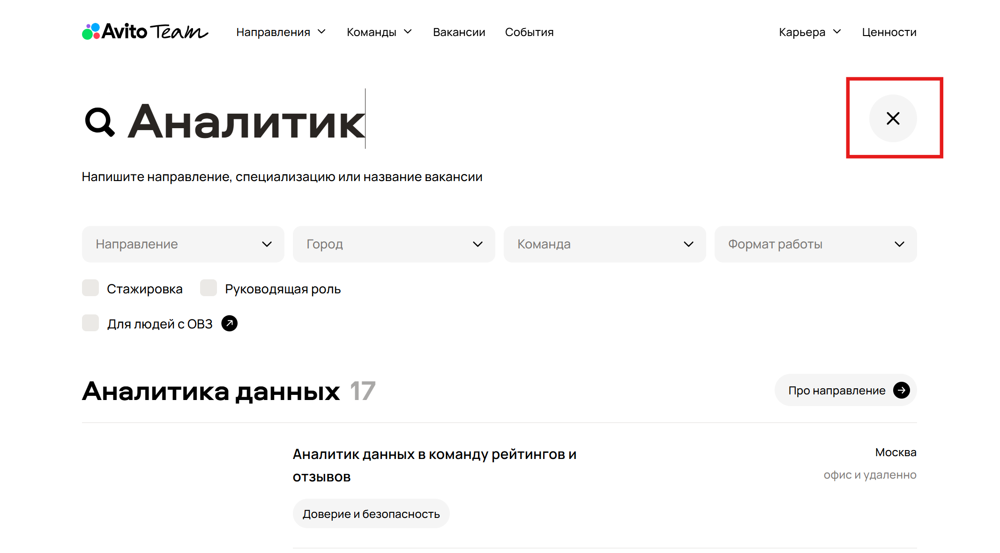

На сайте avito team реализован расширенный поиск вакансий с фильтрами. Так как из вводных данных имеется только скриншот без доступа к документации и макетам проекта, приоритет багов будет оценен исходя из личного здравого смысла. 

## №1. Не отображается иконка "✖" для поисковой строки 

### Priority - low

На скриншоте из задания не отображается иконка крестика у поисковой строки - нарушено визуальное восприятие. Если не было бы возможности перейти на основную актуальную страницу avito team, пользователь и не догадался бы, для чего предназначена эта кнопка/иконка. Приоритет - low, так как можно найти "обходной путь", кликнув на кнопку и определив ее назначение, на остальной функционал поиска вакансий не влияет. 

## №2. При выборе конкретной специализации отображается смешанная поисковая выдача

### Priority - high

В результате выбора конкретной специализации "Поддержка пользователей" по направлению Data Science пользователь ожидает увидеть результат только по данной специализации -  "Ничего не найдено". "Ничего не найдено" отображается прямо по середине списка, и в то же время пользователь видит вакансии выше и ниже этого сообщения. Из-за такой поисковой выдачи есть репутационные риски, что релевантные кандидаты могут не найти подходящую вакансию и сделать выбор в пользу другой компании, сайт страницы вакансий которой работает более стабильно. 

## №3. При выборе конкретного направления поисковая выдача отображает все направления с аналитическими вакансиями

### Priority - medium

На скриншоте видно, что по направлению Data Science доступна 1 вакансия, однако в поисковой выдаче отображаются все доступные направления с аналитическими вакансиями, что может ввести пользователя в заблуждение. Однако счетчик внутри категории работает корректно, а фильтрация по направлению - нет. 

## №4. Фильтр по городу не работает

### Priority - high

На скриншоте по фильтру выбран город Санкт-Петербург, однако в результате поисковой выдачи также отображаются вакансии из Москвы, Самары, что может ввести пользователя в заблуждение. Кандидат может по ошибке откликнуться на вакансию из Самары, когда изначально стоял фильтр по Санкт-Петербургу. 

## №5. Фильтр по формату работы не работает

### Priority - high

На скриншоте видно, что из по фильтру выбран формат работы "можно удаленно", однако в результате поисковой выдачи также отображаются вакансии с форматом работы "офис", "офис и удаленно", что может ввести пользователя в заблуждение. Кандидат может также по невнимательности откликнуться на вакансию с офисным форматом работы, находясь в другом городе. 

## №6. Фильтр по чек-боксу "Руководящая роль" не работает 

### Priority - high

На скриншоте видно, что заполнен чек-бокс "Руководящая роль", однако в результате поисковой выдачи отображаются также вакансии, не относящиеся к руководящей роли. У специалиста и руководителя разный уровень зарплат, ответственности и навыков. Поэтому кандитата это также может ввести в заблуждение и заставить потратить время на изучение каждой вакансии, чтобы найти подходящие именно с руководящей должностью.

## №7. Ошибка логики в фильтре по специализации 

### Priority - low

В поисковой строке введено "Аналитик" выбран фильтр по направлению Data Science. Однако в качестве выбора специализации отображаются дубль "Аналитик", хотя в рузультате поисковой выдачи уже есть вакансии с ключевым словом "Аналитик". Вопрос относится непосредственно к UX-логике, на остальной функционал поиска вакансий этот момент не несет существенного влияния. 

## №8. Ошибка логики в блоке "Ничего не нашлось"

### Priority - medium

В блоке "Ничего не нашлось" содержтся текст: "Попробуйте поменять параметры или сбросить фильтры", где "сбросить фильтры" - активная ссылка. Однако на экране уже имеется кнопка "Сбросить все", наличие двух кнопок с одинаковыми функциями - избыточность интерфейса. Также сам результат "Ничего не нашлось" является ложным, так как выше и ниже отображаются вакансии из других направлений. 

